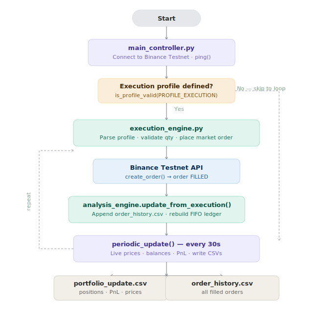

# Analysis Engine

A Python trading bot that connects to the **Binance Testnet**, executes scheduled order profiles, and tracks portfolio PnL in real time.

---

## Why execution profiles matter

Naively dumping a large position into the market in one shot is expensive. Every order moves the price against you — permanently shifting the mid-price and temporarily widening the spread. This is called **market impact**, and it compounds with size.

Academic research (Bertsimas & Lo 1998, Almgren & Chriss 2001, Cheridito & Sepin 2014) shows that **splitting a trade into a timed sequence of smaller orders** — an execution profile — dramatically reduces this cost:

- A **constant-speed strategy** (selling equal slices at regular intervals) minimises expected cost under stable conditions.
- A **risk-aware strategy** (selling faster when volatility or liquidity is poor) further reduces the variance of execution cost, at the price of executing slightly faster.
- In simulations over 35,000 shares across 100 minutes, optimal stochastic strategies produced a mean implementation cost of **$284** vs **$330** for a naive constant-speed approach — an 14% saving — while also reducing cost variance.

This engine is built to run exactly these kinds of parameterised, time-scheduled execution profiles. Rather than a single large market order, you define how much to trade and when, giving you full control over the speed/risk tradeoff.

---

## How it works

```
main_controller.py
│
├── Connects to Binance Testnet
│
├── Reads PROFILE_EXECUTION (e.g. "LINKUSDT BUY t=0s, Δq=1.5")
│         │
│         └── execution_engine.py
│                   ├── Parses and validates each step (lot size, min notional)
│                   ├── Waits the defined delay, then places a market order
│                   └── On fill → calls analysis_engine.update_from_execution()
│
└── Enters periodic loop (every 30s)
          └── analysis_engine.py
                    ├── Fetches live prices and balances from Binance
                    ├── Rebuilds FIFO ledger from full trade history
                    ├── Computes latent PnL and realized PnL per symbol
                    └── Writes portfolio_update.csv and order_history.csv
```

### Flow diagram



---

## Output examples

### `portfolio_update.csv`

| symbol | position | price | value | pnl_latent | avg_buy_price | realized_pnl | bid | ask |
|---|---|---|---|---|---|---|---|---|
| ETHUSDT | 0.05 | 3394.96 | 169.75 | -2.82 | 3451.38 | 0.00 | 3394.96 | 3394.97 |
| LINKUSDT | 19.75 | 15.16 | 299.41 | -4.25 | 15.41 | 0.10 | 15.16 | 15.17 |
| TOTAL | | | 469.16 | -7.07 | | 0.10 | | |
| USDT_CASH | 0.0 | 1.0 | 0.00 | 0.00 | 1.0 | 0.00 | | |

### `order_history.csv`

| symbol | orderId | side | status | origQty | executedQty | time |
|---|---|---|---|---|---|---|
| LINKUSDT | 86441 | BUY | FILLED | 1.50 | 1.50 | 1762935313323 |
| LINKUSDT | 86444 | SELL | FILLED | 0.50 | 0.50 | 1762935330596 |
| ETHUSDT | 966313 | BUY | FILLED | 0.01 | 0.01 | 1762935342409 |
| ETHUSDT | 966879 | BUY | FILLED | 0.01 | 0.01 | 1762935723464 |
| LINKUSDT | 86485 | BUY | FILLED | 1.50 | 1.50 | 1762935694744 |

---

